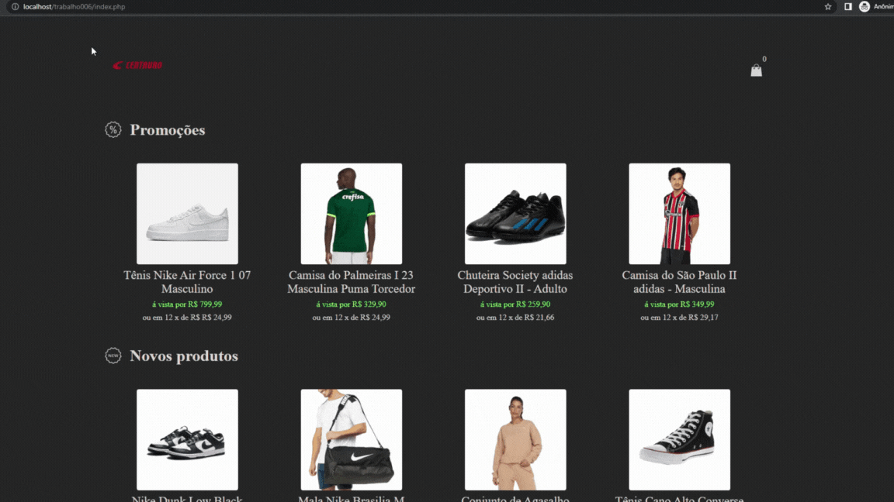

<h1 align="center">E-Commerce</h1>

<h2> 
	Demonstração do projeto
</h2>

    

<h3>
    Projeto de E-commerce feito com PHP. Possui tela de listagem de produtos, detalhes do produto, carrinho e agradecimento. Os produtos são armazenados
em um array de objetos em uma session, e toda a manipulação do carrinho é feito utilizando orientação a objeto, com as classes de produto e carrinho.
 </h3>

## Tecnologias:
  

    
    
    
  

## 👦👧 Autores

Feito por Pedro Arruda e Lara Barros!
